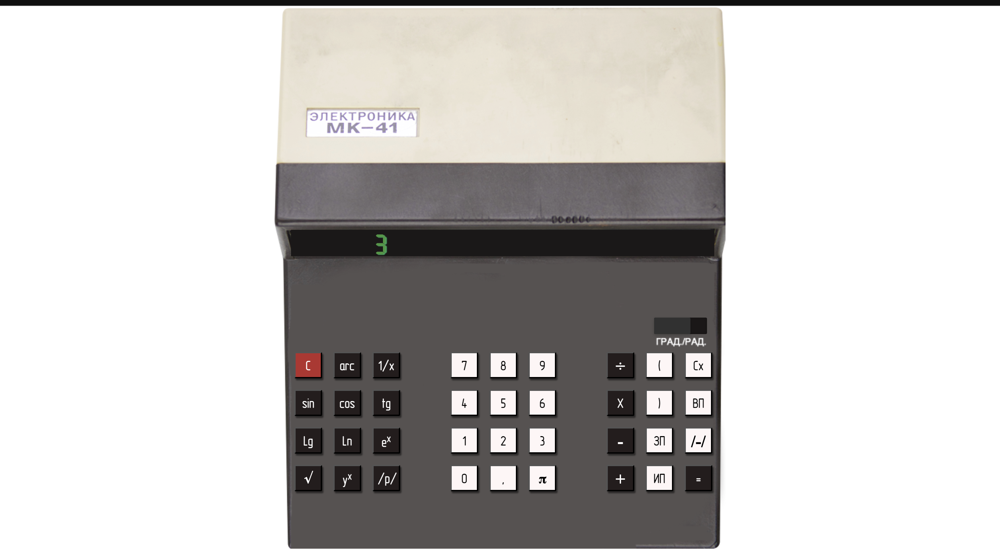

## Example

# Тестирование эмулятора калькулятора MK-41

## 1. Введение
Данный план тестирования описывает стратегию, цели, объем и ресурсы для тестирования эмулятора калькулятора MK-41, доступного по адресу [http://dokuwiki.mgul.ac.ru/emulators/MK41/](http://dokuwiki.mgul.ac.ru/emulators/MK41/). Цель - обеспечить правильную работу всех функций и предоставить удобный интерфейс для пользователя.

## 2. Цели
- Проверка точности арифметических и научных функций.
- Обеспечение удобства и доступности интерфейса калькулятора.
- Проверка функций памяти и обработки ошибок.

## 3. Объем
Тестирование будет охватывать:
- Функциональное тестирование
- Тестирование удобства использования
- Тестирование производительности
- Тестирование совместимости

## 4. Стратегия тестирования
### 4.1 Функциональное тестирование
#### Основные операции:
- Сложение, вычитание, умножение, деление
- Порядок операций (PEMDAS/BODMAS)
- Расчеты с процентами
- Корень квадратный и функции степени

#### Научные функции:
- Тригонометрические функции: sin, cos, tg и их обратные
- Логарифмические функции: log, ln
- Экспоненциальные функции: e^x, 10^x
- Факториал, nPr, nCr
- Гиперболические функции: sinh, cosh, tanh

#### Функции памяти:
- Вызов памяти (MR), очистка памяти (MC), добавление в память (M+), вычитание из памяти (M-)

#### Обработка ошибок:
- Деление на ноль
- Неправильные форматы ввода
- Переполнение и недополнение

### 4.2 Тестирование удобства использования
- Оценка макета и дизайна интерфейса калькулятора.
- Тестирование читаемости и доступности кнопок и дисплея.
- Оценка отзывчивости кнопок и общего взаимодействия с пользователем.
- Проверка доступности функций для пользователей с ограниченными возможностями.

### 4.3 Тестирование производительности
- Тестирование времени отклика для простых и сложных расчетов.
- Измерение времени загрузки калькулятора.
- Оценка производительности при непрерывном использовании и высокой нагрузке.

### 4.4 Тестирование совместимости
- Тестирование на разных веб-браузерах (Chrome, Firefox, Safari, Edge).
- Тестирование на различных устройствах (настольный компьютер, планшет, мобильный телефон).
- Проверка совместимости с различными операционными системами (Windows, macOS, Linux).

## 5. Тестовая среда
- Оборудование: Стандартный ПК или ноутбук с доступом в интернет.
- Программное обеспечение: Веб-браузеры (Chrome, Firefox, Safari, Edge).
- Инструменты: Не требуются специальные инструменты.

## 6. Тестовые случаи
### 6.1 Основные операции
| ID тестового случая | Описание      | Шаги              | Ожидаемый результат  |
|---------------------|---------------|-------------------|----------------------|
| TC-001              | Сложение      | Введите 2 + 3 =   | Дисплей должен показать 5 |
| TC-002              | Вычитание     | Введите 5 - 2 =   | Дисплей должен показать 3 |
| TC-003              | Умножение     | Введите 4 * 5 =   | Дисплей должен показать 20 |
| TC-004              | Деление       | Введите 10 / 2 =  | Дисплей должен показать 5 |

### 6.2 Научные функции
| ID тестового случая | Описание        | Шаги                | Ожидаемый результат     |
|---------------------|-----------------|---------------------|-------------------------|
| TC-005              | Функция синуса  | Введите 30 sin      | Дисплей должен показать 0.5 (при условии, что используются градусы) |
| TC-006              | Логарифм         | Введите 100 log      | Дисплей должен показать 2 |
| TC-007              | Экспоненциальная функция | Введите 2 e^x | Дисплей должен показать 7.389 |
| TC-008              | Факториал       | Введите 5 !         | Дисплей должен показать 120 |

### 6.3 Функции памяти
| ID тестового случая | Описание             | Шаги                  | Ожидаемый результат  |
|---------------------|----------------------|-----------------------|----------------------|
| TC-009              | Добавление в память  | Введите 5 M+ MR       | Дисплей должен показать 5 |
| TC-010              | Вычитание из памяти  | Введите 3 M- MR       | Дисплей должен показать 2 |
| TC-011              | Очистка памяти       | Введите MC MR         | Дисплей должен показать 0 |

### 6.4 Обработка ошибок
| ID тестового случая | Описание          | Шаги              | Ожидаемый результат |
|---------------------|-------------------|-------------------|---------------------|
| TC-012              | Деление на ноль   | Введите 5 / 0 =   | Дисплей должен показать сообщение об ошибке или Infinity |
| TC-013              | Неверный ввод     | Введите abc       | Дисплей должен показать сообщение об ошибке |
| TC-014              | Переполнение      | Выполните расчет, который превышает предел дисплея | Дисплей должен показать ошибку или обработать ситуацию корректно |

## 7. Расписание тестирования
- Подготовительный этап: 1 неделя
- Этап выполнения: 2 недели
- Этап отчетности: 1 неделя

## 8. Ресурсы
- Персонал: 2 тестировщика, 1 руководитель тестирования
- Инструменты: Веб-браузеры (Chrome, Firefox, Safari, Edge).

## 9. Риски и их минимизация
| Риск                       | Стратегия минимизации                                      |
|----------------------------|-------------------------------------------------------------|
| Задержка исправления ошибок | Приоритизация критических ошибок                             |
| Несовместимость браузеров   | Проведение раннего тестирования совместимости               |

## 10. Утверждение
Заинтересованные стороны: Менеджер по качеству, руководитель разработки, владелец продукта

---

## Контрольный список тестовых случаев

| ID тестового случая | Описание      | Статус  | Примечания       |
|---------------------|---------------|---------|------------------|
| TC-001              | Сложение      | Пройдено|                  |
| TC-002              | Вычитание     | Пройдено|                  |
| TC-003              | Умножение     | Пройдено|                  |
| TC-004              | Деление       | Пройдено|                  |
| TC-005              | Функция синуса| Пройдено|                  |
| TC-006              | Логарифм      | Пройдено|                  |
| TC-007              | Экспоненциальная функция | Пройдено|          |
| TC-008              | Факториал     | Пройдено|                  |
| TC-009              | Добавление в память | Пройдено|              |
| TC-010              | Вычитание из памяти | Пройдено|              |
| TC-011              | Очистка памяти| Пройдено|                  |
| TC-012              | Деление на ноль| Пройдено|                  |
| TC-013              | Неверный ввод | Пройдено|                  |
| TC-014              | Переполнение  | Пройдено|                  |

---

## Шаблон отчета об ошибке
### ID ошибки: 001
#### Заголовок: Неправильный результат для sin(90)
#### Описание:
При вычислении синуса 90 градусов результат 0.894 вместо 1.
#### Шаги для воспроизведения:
1. Введите 90
2. Нажмите sin
#### Ожидаемый результат:
Дисплей должен показать 1
#### Фактический результат:
Дисплей показывает 0.894
#### Серьезность: Высокая
#### Приоритет: Высокий
#### Сообщено: Имя тестировщика
#### Дата: 2024-07-04

---

## Шаблон отчета о тестировании
### Название проекта: Эмулятор калькулятора MK-41
### Тестировщики: Название команды
### Дата: 2024-07-04

#### Резюме:
Все тестовые случаи были выполнены. Большинство функций работало корректно, за исключением некоторых тригонометрических расчетов.

#### Статистика прохождения/непрохождения:
| ID тестового случая | Статус   |
|---------------------|----------|
| TC-001              | Пройдено |
| TC-002              | Пройдено |
| TC-003              | Пройдено |
| TC-004              | Пройдено |
| TC-005              | Пройдено |
| TC-006              | Пройдено |
| TC-007              | Пройдено |
| TC-008              | Пройдено |
| TC-009              | Пройдено |
| TC-010              | Пройдено |
| TC-011              | Пройдено |
| TC-012              | Пройдено |
| TC-013              | Пройдено |
| TC-014              | Пройдено |

#### Найденные ошибки:
- Неправильный результат для sin(90) (ID ошибки: 001)

#### Заключение:
Эмулятор калькулятора MK-41 прошел большинство функциональных тестов. Обнаруженные проблемы необходимо решить для обеспечения точности научных расчетов.

---

## Руководство пользователя
### Руководство пользователя эмулятора калькулятора MK-41

### 1. Основные операции
- Сложение: Введите number1 + number2 =
- Вычитание: Введите number1 - number2 =
- Умножение: Введите number1 * number2 =
- Деление: Введите number1 / number2 =

### 2. Научные функции
- Синус: Введите angle sin
- Косинус: Введите angle cos
- Логарифм (base 10): Введите number log
- Натуральный логарифм: Введите number ln
- Экспоненциальная функция: Введите number e^x
- Факториал: Введите number !

### 3. Функции памяти
- Вызов памяти (MR): Отображает текущее значение в памяти.
- Очистка памяти (MC): Очищает память.
- Добавление в память (M+): Добавляет отображаемое значение в память.
- Вычитание из памяти (M-): Вычитает отображаемое значение из памяти.

### 4. Обработка ошибок
- Деление на ноль: Отображает сообщение об ошибке или Infinity.
- Неверный ввод: Отображает сообщение об ошибке.

